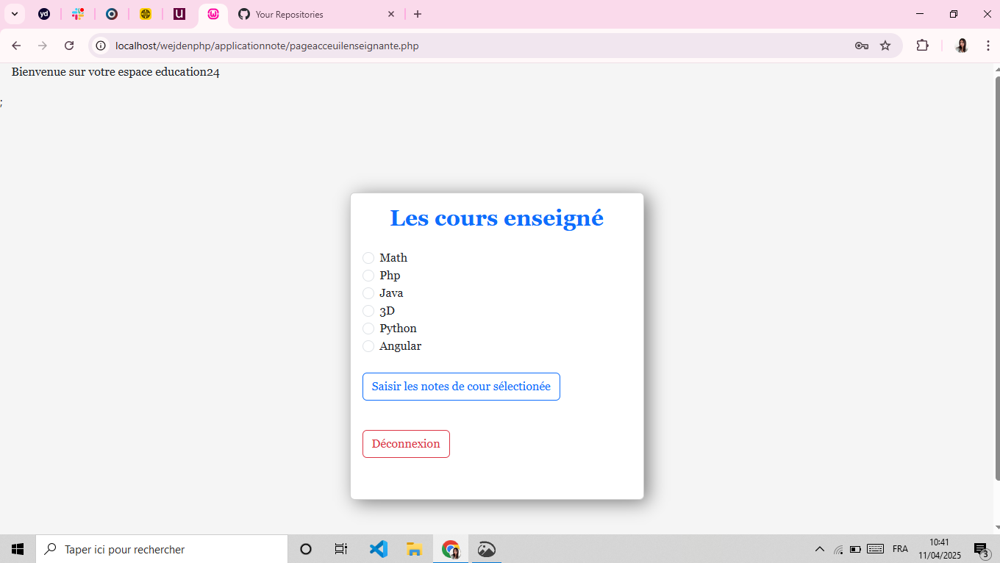
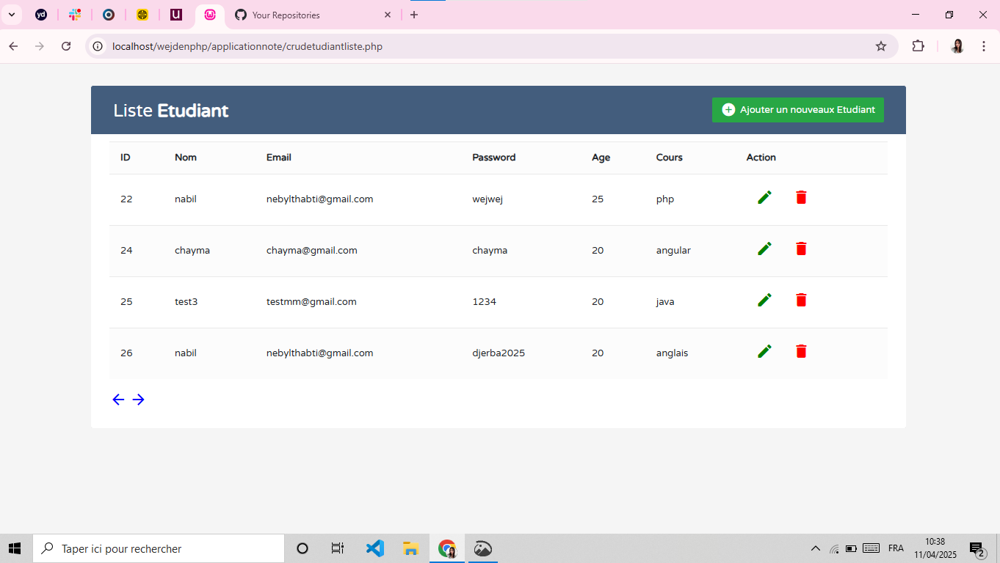
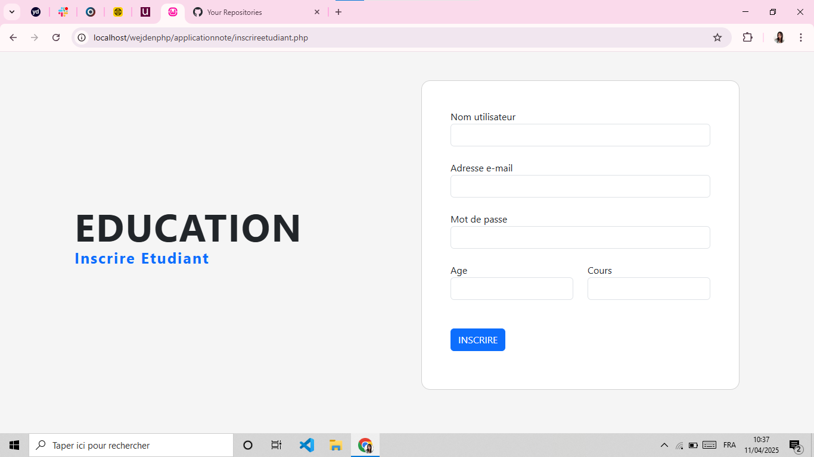
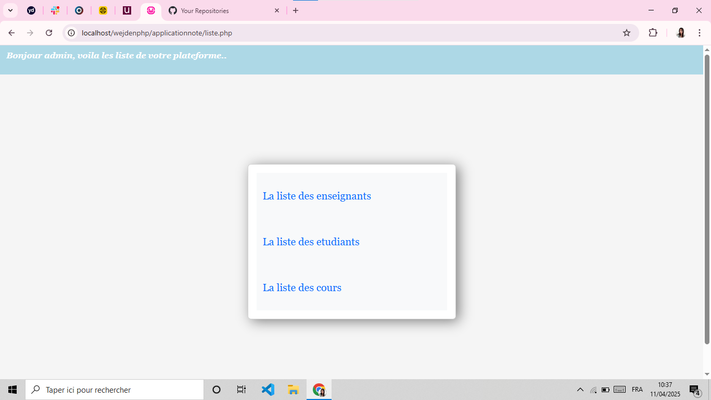
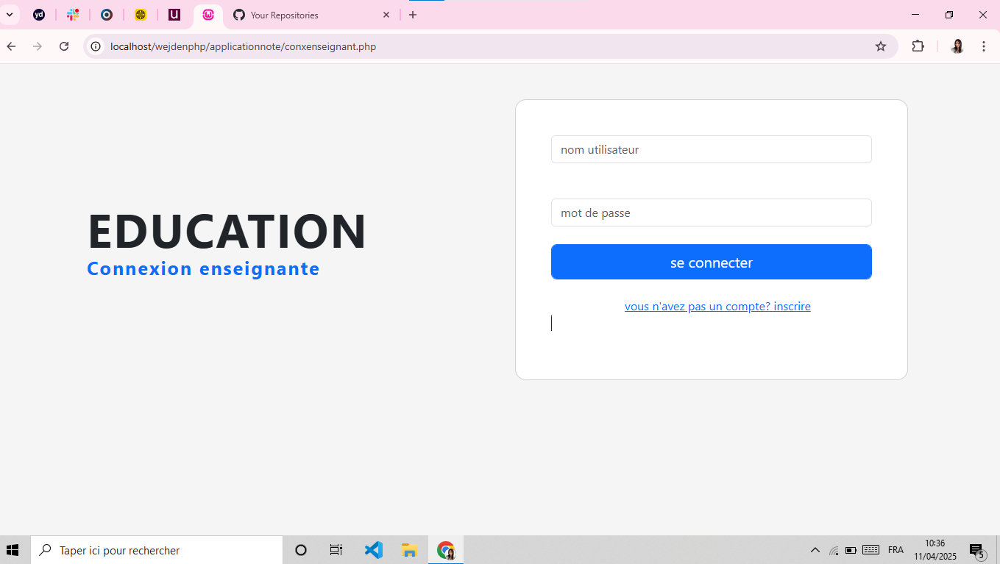

# Gestion des Cours et Étudiants

Cette application PHP permet de gérer les étudiants, les cours et l'enseignement dans un établissement scolaire. Elle inclut un système sécurisé de gestion des utilisateurs, ainsi qu'une interface d'administration pour la gestion complète des informations. Les administrateurs peuvent ajouter, modifier, supprimer et afficher les étudiants, les cours, ainsi que les enseignants grâce à un système CRUD.

## Fonctionnalités

- **Gestion des étudiants** : Ajout, modification, suppression et consultation des étudiants dans la base de données.
- **Gestion des cours** : Ajout, modification, suppression et consultation des cours.
- **Gestion des enseignants** : Permet l'affectation des enseignants aux différents cours.
- **Authentification et autorisation** : Système de connexion sécurisé avec gestion des sessions et cookies.
- **Interface administrateur** : Une interface dédiée à l'administrateur pour gérer les étudiants, les enseignants et les cours via des opérations CRUD.
- **Base de données** : Utilisation d'une base de données MySQL pour stocker les informations des étudiants, des cours et des enseignants.

## Technologies utilisées

- **PHP** 
- **MySQL** 
- **HTML/CSS** 
- **Sessions et Cookies** 
## Captures d'écran

Voici quelques captures d'écran de l'application :








## Installation

1. Clonez ce dépôt sur votre machine :
   ```bash
   git clone https://github.com/wejdeen14/Application.git
